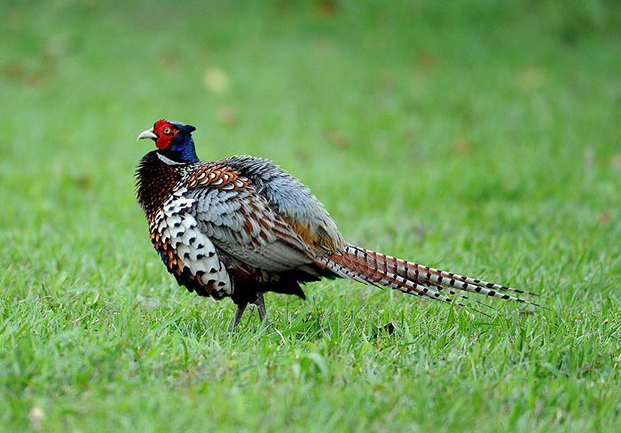

# 这是一级标题

几个#号就是几级标题

- ## 二级

- ### 三级

- #### 四级

- ##### 五级

- ###### 共六个标题级别

## 字体

- 前后各2个星号会 **加粗**

- 前后各1个星号会 *斜体*

- 前后各3个星号既 ***加粗又倾斜***

- 前后各2个波浪号会 ~~显示删除线~~

## 引用

大于号

> 一个大于号，后面就显示了引用了别人的话，
> 引用在markdown的文件里换行不太好使，
> 貌似既然你想引用，就一口气说完
>> 这是引用的嵌套，是不是显得高级了
>>> 大同小异

## 分隔线

---
三个减号或者三个星号，都可以制作一条分隔线

## 图片

感叹号 方括号 小括号




## 超链接

方括号 小括号

[百度](https://www.baidu.com)

## 列表

### 有序列表

数字 英文符号 空格 你想输入的内容

1. 这是第1条
2. 这是第2条

### 无序列表

减号 空格 你想输入的内容

- 你瞅啥
- 瞅你咋地
- 过来试试
  - 试试就试
  - 是啊
  
## 表格

竖号 表头 竖号 表头

| 姓名   |   年龄   |   性别 |
| ------ | :------: | -----: |
| 左对齐 | 中间对齐 | 右对齐 |
| a      |    b     |      c |

## 代码块

三个反点号 语言名称

```C++
#include <iostream>
using namespace std;
int main()
{
    cout << "Hellow World!\n";
    return 0;
}
